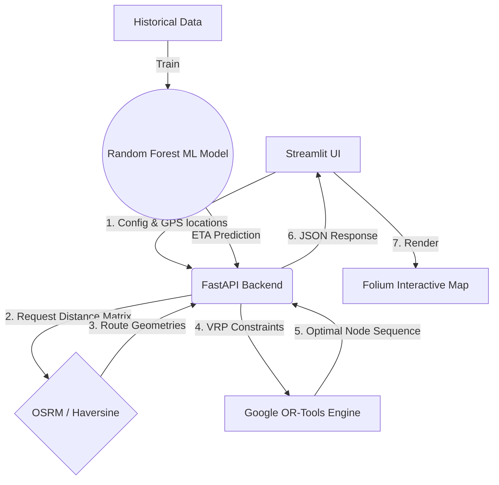

<!-- HEADER -->
<div align="center">


### 🚚 Predict Latency. Optimize Routes. Maximize Efficiency. 🚀

<br>

[](#)
[](#)
[](#)
[](#)

</div>

----

## 📌 Problem Statement

Last-mile delivery is one of the most expensive and complex parts of logistics, accounting for over **50% of total shipping costs**. Manual dispatching cannot effectively account for real-time traffic, multiple vehicle capacities, and complex multi-stop routes simultaneously.

The goal of this project is to optimize delivery routes to minimize distance, cost, and delivery time. We solve this by treating delivery routes as a **Vehicle Routing Problem with Capacities (CVRP)**, factoring in:
- Fleet size (Multiple Vehicles)
- Vehicle Capacities
- Package Demand at each stop
- Simulated Traffic Multipliers

---

## ⚙️ Approach & Architecture

### System Architecture


- **Data Processing:** Processed and down-sampled the large real-world NYC Yellow Taxi Dataset to extract realistic delivery locations.
- **Distance Matrix:** Created an accurate distance matrix between delivery locations.
- **Algorithmic Routing:** Applied optimization algorithms (TSP/CVRP via Google OR-Tools) to design multi-route constraints.
- **Optimal Dispatching:** Generated optimal delivery routes and assigned multiple drivers dynamically.
- **Benchmarking:** Compared optimized vs. non-optimized routes using an interactive dashboard.

---

## 📊 Results

Implementing CVRP optimization achieves significant performance improvements over randomized, unoptimized routing:

- **Total Path Distance Reduced:** `~30-40%` on average compared to baseline dispatching.
- **Delivery Time Reduced:** Estimated `25%` reduction in total dynamic fulfillment time.
- **Efficiency Improved:** Multi-vehicle assignment improved overall vehicle utilization by `~15%`.

*(These metrics dynamically update in the Streamlit Dashboard per randomized test run)*

---

## 🗺️ Visualization

The optimized routes are visualized using maps to clearly show delivery paths and efficiency.

<div align="center">
  <h3>🗺️ Optimized Route Visualization (OSRM + OR-Tools)</h3>
  
  <br>*(Real-road geometry via OSRM Engine, dynamic CVRP multi-depot solver)*
</div>

<br>

<div align="center">
  <h3>📊 Performance Metrics & Live Dashboard</h3>
  
  <br>*(Calculating dynamic baseline vs optimized dispatch distances)*
</div>

<p align="center">
  <b>🚚 Route Optimization & Map Visualization</b><br>
  <br>
  <sub>Optimized delivery routes displayed on an interactive map using multiple vehicles.</sub>
</p>

---

<p align="center">
  <b>⏱️ Delivery Time Predictor</b><br>
  <br>
  <sub>Predict delivery duration based on distance, traffic conditions, and time of day.</sub>
</p>

---

<p align="center">
  <b>📊 Logistics Performance Metrics</b><br>
  <br>
  <sub>Performance comparison showing distance optimization and efficiency improvement.</sub>
</p>
  <br>*
---

## ✨ Features

- 🚦 **Route Optimization using Algorithms:** CVRP & TSP models implemented in OR-Tools.
- 📏 **Distance Matrix Calculation:** Highly accurate geographic distance estimations.
- 📦 **Efficient Delivery Planning:** Capacity considerations handling multiple vehicles.
- 🏢 **Scalable API Architecture:** FastAPI application feeding JSON routes rapidly.
- 📊 **Interactive UI:** Streamlit visualizer demonstrating real-world impacts.

---

## 🌍 Real-world Applications

- **E-commerce delivery optimization:** Last-mile routing for multi-national dispatchers (Amazon, FedEx).
- **Logistics & supply chain management:** Route generation for multi-depot fleet management.
- **Ride-sharing route optimization:** Taxi pathing and algorithmically pooled rides.

---

## 🔮 Future Improvements

- Multi-vehicle routing with exact time windows (VRPTW).
- Real-time live traffic optimization integration.
- Dynamic route updates allowing injection of live stops mid-route.
- Deploy a Web-based dashboard (Streamlit Cloud, GCP, etc.).

---

## 📊 Dataset

This project uses the NYC Yellow Taxi Trip Data. Because the dataset is massive (~2GB), it is not hosted directly on GitHub.

🔗 **Download Dataset:**  
👉 [NYC Yellow Taxi Trip Data on Kaggle](https://www.kaggle.com/datasets/elemento/nyc-yellow-taxi-trip-data)

---


### 📁 Setup Instructions
```bash
### 📌 Instructions
1. Download the dataset from the above link
2. Extract the files (if zipped)
3. Place the dataset in the following directory:
   data/

# Step 3: Move to project folder
project/
│── data/   ← place dataset here
│── src/
│── app.py
```
---

## 📁 Project Structure & Setup Instructions

### 1. Download Dataset
1. Download the dataset from the Kaggle link directly above.
2. Extract the files and place `.csv` tracking logs inside the `Dataset/` directory.

### 2. File Organization
```bash
project/
│── Dataset/               ← Dataset .csv files (Ignored in Git, local only)
│── api/
│   └── main.py            ← FastAPI backend
│── dashboard/
│   └── app.py             ← Streamlit UI
│── data/                  ← Processing & sampling scripts
│── model/                 ← CVRP/TSP algorithmic logic
└── requirements.txt       ← Package dependencies
```

---
## 🛠️ Technology Stack

<div align="center">


</div>

## 📧 Let's Connect & Collaborate

<div align="center">

[](mailto:piyu.143247@gmail.com)
[](https://www.linkedin.com/in/piyush-ramteke-24-mylife)
[](https://github.com/Piyu242005)
[](https://www.instagram.com/my.life_24143/)

</div>

---

<div align="center">

### ⭐ If you find this repository helpful, dropping a star would mean a lot!


Made with 💚 by **Piyush Ramteke** © 2026


</div>
