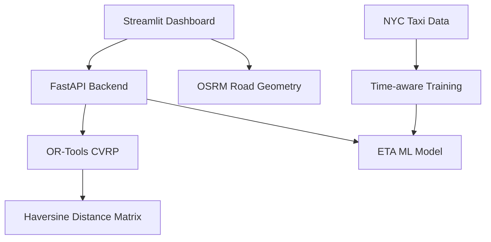

# 🚚 Last-Mile Delivery Optimization

### ML-Powered ETA Prediction + Fleet Routing Decision Support

A logistics optimization platform combining **Machine Learning, Operations Research, geospatial routing, and interactive analytics** to improve multi-vehicle last-mile delivery planning.

## ✨ Features

- **Capacitated Vehicle Routing (CVRP)** with OR-Tools
- Vehicle capacity and delivery-demand constraints
- Nearest-neighbor baseline vs optimized route comparison
- Configurable traffic scenarios
- Road-network geometry using OSRM
- ML ETA prediction with analytical fallback
- Fleet utilization and vehicle-level analytics
- Scenario presets for small fleet, busy day, and high traffic
- Interactive Folium route maps
- Dynamic order simulation
- CSV and JSON report export
- FastAPI backend with Pydantic validation
- Streamlit Cloud deployment support
- Python 3.13 runtime pin for compatible dependency wheels

## 🏗️ Architecture


```mermaid
graph TD
    UI[Streamlit Dashboard] --> API[FastAPI Backend]
    API --> CVRP[OR-Tools CVRP]
    CVRP --> DIST[Haversine Distance Matrix]
    API --> ETA[ETA ML Model]
    UI --> OSRM[OSRM Road Geometry]
    DATA[NYC Taxi Data] --> TRAIN[Time-aware Training]
    TRAIN --> ETA
```

## 🤖 ETA Prediction

The training pipeline compares:

- Linear Regression
- Random Forest Regressor
- XGBoost Regressor

Features include distance, hour, day-of-week, weekend status and speed. Chronological validation is used when timestamps are available, reducing temporal leakage.

The API returns whether the prediction came from the trained model or the analytical fallback.

## 🧭 Route Optimization

The routing engine supports:

- Multiple vehicles
- Per-vehicle capacities
- Delivery demands
- Depot start/end
- Configurable traffic factor
- Feasibility validation
- Time-limited guided local search
- Baseline comparison

The system reports a **feasible optimized solution**, not a guaranteed global optimum.

## 📊 Dashboard

### Route Optimizer
Configure fleet size, capacity, traffic and delivery demand, then optimize the fleet and visualize each route on a road map.

### Fleet Analytics
View:

- Optimized distance
- Distance saved
- Efficiency improvement
- Fleet utilization
- Vehicle-level distance/load
- Baseline vs OR-Tools comparison

### ETA Predictor
Estimate delivery duration for a trip using distance, speed, time of day and weekday.

### Reports
Download:

- Fleet CSV report
- Complete optimization JSON

## 🚀 Run Locally

```bash
python -m venv .venv
# Windows
.venv\\Scripts\\activate
# macOS/Linux
source .venv/bin/activate

pip install -r requirements.txt
pytest -q

python model/train.py --subset 100000
uvicorn api.main:app --reload --port 8000
```

In another terminal:

```bash
streamlit run dashboard/app.py
```

For the deployed Streamlit dashboard, configure `API_URL` in Streamlit Secrets to point to the deployed FastAPI service.

## 🔌 API

```text
GET  /health
POST /optimize-route
POST /predict
```

## 📁 Project Structure

```text
api/                 # FastAPI backend
 dashboard/          # Streamlit dashboard
model/               # ETA training + route optimization
data/                # preprocessing/statistics
notebooks/           # EDA
 tests/              # API + optimizer tests
requirements.txt
.python-version
vercel.json
README.md
```

## 📦 Dataset

NYC Yellow Taxi data is used for realistic geographic and temporal features. Large raw datasets are intentionally not committed.

## ⚠️ Current Limitations

- Traffic is scenario-based rather than live traffic.
- Optimization currently uses CVRP rather than full time-window routing.
- Multi-depot routing and dynamic re-routing are not yet implemented.
- Production observability and model monitoring are not yet implemented.

## 🗺️ Roadmap

- [ ] Vehicle Routing Problem with Time Windows (VRPTW)
- [ ] Multi-depot optimization
- [ ] Live traffic integration
- [ ] Dynamic re-routing simulation
- [ ] Driver/vehicle assignment
- [ ] Fuel-cost and CO₂ estimation
- [ ] SLA / late-delivery prediction
- [ ] Historical route-performance store
- [ ] What-if scenario comparison
- [ ] API monitoring and model versioning

## 👨‍💻 Author

**Piyush Ramteke** — Data Scientist | AI Engineer | Python Developer
