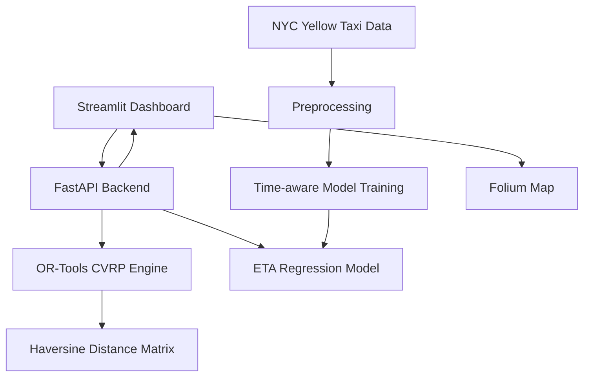

# 🚚 Last-Mile Delivery Optimization

> **ML-powered ETA prediction + Capacitated Vehicle Routing (CVRP) for multi-vehicle last-mile logistics.**

[](#)
[](#)
[](#)
[](#)
[](https://github.com/Piyu242005/Last-Mile-Delivery-Optimization/actions/workflows/ci.yml)

## Overview

This project combines **Operations Research, Machine Learning, geospatial distance calculation, and API engineering** to improve last-mile delivery planning.

The system:

1. Accepts a depot, delivery stops, fleet size, capacities, demands, and traffic factor.
2. Builds a geographic distance matrix using the Haversine formula.
3. Solves a **Capacitated Vehicle Routing Problem (CVRP)** with Google OR-Tools.
4. Compares the optimized solution with a deterministic **nearest-neighbor round-trip baseline**.
5. Predicts delivery duration using a trained regression model when available, with an analytical fallback.
6. Displays routes and logistics metrics through Streamlit + Folium.

## Architecture


```mermaid
graph TD
    UI[Streamlit Dashboard] --> API[FastAPI Backend]
    API --> ROUTE[OR-Tools CVRP Engine]
    ROUTE --> DIST[Haversine Distance Matrix]
    API --> ETA[ETA Regression Model]
    DATA[NYC Yellow Taxi Data] --> PREP[Preprocessing]
    PREP --> TRAIN[Time-aware Model Training]
    TRAIN --> ETA
    API --> UI
    UI --> MAP[Folium Map]
```

## Core Optimization Model

The routing engine minimizes total route distance while enforcing fleet-capacity constraints.

- **Decision:** assign every delivery stop to a vehicle and determine visit order.
- **Constraint:** route demand must not exceed vehicle capacity.
- **Coverage:** each delivery stop is visited exactly once.
- **Depot:** every active vehicle starts and returns to the depot.
- **Search:** `PATH_CHEAPEST_ARC` followed by `GUIDED_LOCAL_SEARCH` with a 3-second solver budget.

### Baseline methodology

The project now uses a reproducible **nearest-neighbor round-trip baseline** rather than summing independent depot-to-stop distances. This makes the optimization-improvement percentage more meaningful.

> Note: CVRP with a time-limited heuristic search is not guaranteed to be mathematically optimal for every input. The API therefore reports **"Feasible solution found"** rather than claiming global optimality.

## ETA Machine Learning

Three regression models are compared:

- Linear Regression
- Random Forest Regressor
- XGBoost Regressor

Features:

`haversine_km`, `hour_of_day`, `day_of_week`, `is_weekend`, `speed_mph`

Metrics:

- MAE
- RMSE
- R²

### Validation

The training pipeline uses a **chronological 80/20 split** when a timestamp is available, keeping newer observations unseen during training. This is more appropriate for time-dependent ETA prediction than a purely random split.

Run training with:

```bash
python model/train.py --subset 100000
```

Metrics are saved to `model/metrics.json` and the selected model is saved as `model/best_model.pkl`.

## API

Start the backend:

```bash
uvicorn api.main:app --reload --port 8000
```

Health check:

```text
GET /health
```

Route optimization:

```text
POST /optimize-route
```

ETA prediction:

```text
POST /predict
```

The API validates coordinate ranges, fleet configuration, demand lengths, capacities, and prediction inputs. Route errors return structured HTTP errors instead of being silently swallowed.

## Dashboard

Start Streamlit:

```bash
streamlit run dashboard/app.py
```

The dashboard provides interactive route visualization, delivery metrics, and ETA prediction.

## Project Structure

```text
.
├── api/
│   └── main.py
├── dashboard/
│   └── app.py
├── data/
│   ├── preprocess.py
│   └── dataset_stats.json
├── model/
│   ├── route_optimizer.py
│   ├── train.py
│   └── metrics.json
├── notebooks/
│   └── 01_eda.ipynb
├── tests/
│   ├── test_api.py
│   └── test_route_optimizer.py
├── Screenshot/
├── requirements.txt
├── vercel.json
└── README.md
```

## Dataset

The project uses the **NYC Yellow Taxi Trip Dataset** for realistic geospatial and temporal delivery-style features. The large raw dataset is intentionally not committed to GitHub.

Download the dataset from the Kaggle source referenced in the project documentation, then run the preprocessing pipeline to create the local processed dataset.

## Reproducibility

```bash
# 1. Create environment
python -m venv .venv

# 2. Activate it
# Windows
.venv\\Scripts\\activate
# macOS/Linux
source .venv/bin/activate

# 3. Install pinned dependencies
pip install -r requirements.txt

# 4. Run tests
pytest -q

# 5. Train ETA model after preparing the dataset
python model/train.py --subset 100000

# 6. Run API
uvicorn api.main:app --reload --port 8000

# 7. Run dashboard in another terminal
streamlit run dashboard/app.py
```

## Testing & CI

The GitHub Actions workflow now performs:

- Python compilation checks
- Automated pytest suite
- Critical flake8 checks
- Dependency installation from pinned versions

Tests cover routing behavior, capacity validation, invalid inputs, API health, and prediction validation.

## Results & Benchmarking

Optimization performance is **input-dependent**. The dashboard calculates baseline distance, optimized distance, saved distance, and percentage improvement for each run.

Do not interpret a single randomized run as a universal 30–40% improvement. For a defensible benchmark, run the same dataset/scenario across multiple seeds and report mean, median, and variance.

Recommended benchmark table:

| Metric | Baseline | Optimized | Improvement |
|---|---:|---:|---:|
| Route distance (km) | Runtime | Runtime | Runtime |
| Delivery duration (min) | Runtime | Runtime | Runtime |
| Vehicle utilization (%) | Runtime | Runtime | Runtime |

## Limitations

- Haversine distance is a geographic approximation; it does not always represent real road distance.
- Traffic is represented by a configurable factor rather than a live traffic feed.
- The CVRP solver uses a time-limited heuristic search and may not find the global optimum.
- ETA accuracy depends on the quality and temporal coverage of the training data.
- Live dynamic re-routing and explicit time-window constraints are not yet implemented.

## Roadmap

- [ ] OSRM/road-network distance as the primary routing matrix
- [ ] VRPTW with delivery time windows
- [ ] Live traffic integration
- [ ] Dynamic stop insertion and re-routing
- [ ] Multi-depot optimization
- [ ] More rigorous rolling/temporal model validation
- [ ] Production deployment with monitoring and model versioning

## Why this project matters

This project demonstrates practical skills across:

**Python · Pandas · Scikit-learn · XGBoost · Google OR-Tools · FastAPI · Streamlit · Folium · Geospatial Analytics · Operations Research · Machine Learning · CI/CD**

---

Made with ❤️ by **Piyush Ramteke**
