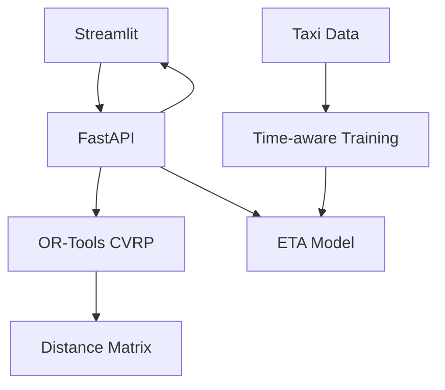

# 🚚 Last-Mile Delivery Optimization

### ML-Powered ETA Prediction + Capacitated Vehicle Routing

This project combines **Machine Learning, Operations Research and geospatial analytics** to improve multi-vehicle last-mile delivery planning.

> **Purpose:** I created this project to solve a real logistics problem: predict delivery duration and then use optimization algorithms to assign stops to vehicles while respecting capacity constraints.

## 🎯 What It Does

1. Accepts depot, delivery stops, fleet size, capacities and demands.
2. Builds geographic distances with the Haversine formula.
3. Solves a **Capacitated Vehicle Routing Problem (CVRP)** with OR-Tools.
4. Compares the optimized route with a reproducible nearest-neighbor baseline.
5. Predicts ETA using regression models with an analytical fallback.
6. Visualizes routes and metrics through Streamlit/Folium.

## 🏗️ Architecture


```mermaid
graph TD
    UI[Streamlit] --> API[FastAPI]
    API --> CVRP[OR-Tools CVRP]
    CVRP --> DIST[Distance Matrix]
    API --> ETA[ETA Model]
    DATA[Taxi Data] --> TRAIN[Time-aware Training]
    TRAIN --> ETA
    API --> UI
```

## 🤖 ETA Models

Compared models:

- Linear Regression
- Random Forest Regressor
- XGBoost Regressor

Features include distance, hour, day-of-week, weekend status and speed. Validation uses a **chronological 80/20 split** when timestamps are available.

## 📊 Optimization

The solver minimizes route distance while enforcing:

- Every stop visited exactly once
- Vehicle capacity constraints
- Depot start/end
- Time-limited heuristic search

> A time-limited CVRP search is not guaranteed to find the global optimum. The application therefore reports a feasible optimized solution rather than claiming mathematical optimality.

## 🚀 Run Locally

```bash
python -m venv .venv
# Windows: .venv\\Scripts\\activate
# macOS/Linux: source .venv/bin/activate
pip install -r requirements.txt
pytest -q
python model/train.py --subset 100000
uvicorn api.main:app --reload --port 8000
```

Run the dashboard separately:

```bash
streamlit run dashboard/app.py
```

## 🔌 API

```text
GET  /health
POST /optimize-route
POST /predict
```

The API validates coordinates, fleet configuration, capacities, demands and prediction inputs.

## 📁 Structure

```text
api/                 # FastAPI backend
 dashboard/           # Streamlit UI
model/               # ETA training + route optimization
data/                # preprocessing/statistics
notebooks/            # EDA
tests/                # API + optimizer tests
requirements.txt
vercel.json
README.md
```

## 📦 Dataset

The project uses NYC Yellow Taxi data for realistic geographic and temporal features. Large raw datasets are intentionally not committed.

## ⚠️ Limitations

- Haversine distance is not road-network distance.
- Traffic uses a configurable factor rather than live traffic.
- CVRP uses a time-limited heuristic solver.
- Live re-routing and explicit delivery time windows are not yet implemented.

## 🗺️ Roadmap

- [ ] OSRM/road-network distances
- [ ] Vehicle Routing Problem with Time Windows
- [ ] Live traffic integration
- [ ] Dynamic re-routing
- [ ] Multi-depot optimization
- [ ] Rolling temporal model validation
- [ ] Production monitoring/model versioning

## 👨‍💻 Author

**Piyush Ramteke** — Data Scientist | AI Engineer | Python Developer
