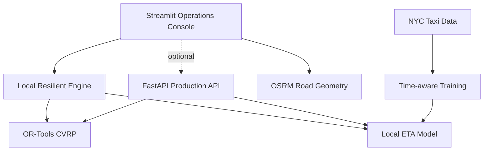

# 🚚 Last-Mile Delivery Optimization

### ML-Powered Fleet Intelligence & Route Decision Support

A production-style logistics platform combining **Machine Learning, Operations Research, geospatial routing, and interactive analytics** for multi-vehicle last-mile delivery planning.

## ⭐ What it does

**Plan → Optimize → Predict → Simulate → Measure → Export**

- Capacitated Vehicle Routing (CVRP) with OR-Tools
- Vehicle capacity and delivery-demand constraints
- Nearest-neighbor baseline vs optimized routing
- Scenario-based traffic modelling
- OSRM road-network visualization with caching
- XGBoost/Random Forest/Linear Regression ETA benchmarking
- Chronological ML validation to reduce temporal leakage
- Local ML + local OR-Tools fallback for resilient Streamlit deployment
- Optional FastAPI/Vercel production backend
- Fleet utilization, fuel and CO₂ scenario estimates
- Dynamic order simulation
- What-if scenario lab
- CSV and JSON audit reports
- Premium black/red operations-console UI
- Python 3.13 runtime for compatible scientific wheels

## 🏗️ Architecture


```mermaid
graph TD
    UI[Streamlit Operations Console] --> LOCAL[Local Resilient Engine]
    UI -. optional .-> API[FastAPI Production API]
    LOCAL --> CVRP[OR-Tools CVRP]
    LOCAL --> ETA[Local ETA Model]
    API --> CVRP
    API --> ETA
    UI --> OSRM[OSRM Road Geometry]
    DATA[NYC Taxi Data] --> TRAIN[Time-aware Training]
    TRAIN --> ETA
```

### Deployment resilience

The dashboard **does not require `API_URL` to open or operate**. If a FastAPI URL is configured and healthy it is preferred; otherwise Streamlit automatically uses the local OR-Tools and local trained ETA model. This prevents the dashboard from becoming unusable because of a missing backend secret.

## 🤖 ETA Intelligence

Three models are benchmarked:

- Linear Regression
- Random Forest
- XGBoost

Current stored benchmark selects **XGBoost** with RMSE 2.98 minutes and R² 0.888. citeturn68file0

Features:

`haversine_km`, `hour_of_day`, `day_of_week`, `is_weekend`, `speed_mph`

The API/dashboard identifies whether an ETA came from the trained model or analytical fallback.

## 🧭 Routing Engine

The CVRP engine supports:

- Multiple vehicles
- Per-vehicle capacity
- Delivery demand
- Depot start/end
- Traffic multiplier
- Feasibility validation
- Guided local search
- Baseline comparison

The result is a **feasible optimized solution**, not a mathematically guaranteed global optimum. citeturn63file0

## 📊 Operations Console

### Route Control

Configure vehicles, capacity, traffic and orders. Optimize the fleet and visualize road geometry on a dark map.

### Fleet Analytics

Monitor:

- Optimized distance
- Distance saved
- Efficiency improvement
- Fleet utilization
- Vehicle-level distance/load
- Estimated fuel consumption
- Estimated fuel cost
- Scenario CO₂ emissions

### ETA Intelligence

Predict delivery time using the trained model, with a resilient local fallback.

### Scenario Lab

Test:

- Normal operations
- Peak traffic
- High demand
- Resilient fleet sizing

### Reports

Download:

- Fleet CSV
- JSON optimization audit

## 🔌 FastAPI

```text
GET  /
GET  /health
POST /optimize-route
POST /predict
```

The API includes CORS, strict Pydantic validation, health diagnostics and model-load reporting.

## 🚀 Run locally

```bash
python -m venv .venv
# Windows
.venv\\Scripts\\activate
# macOS/Linux
source .venv/bin/activate

pip install -r requirements.txt
pytest -q

streamlit run dashboard/app.py
```

Optional API:

```bash
uvicorn api.main:app --reload --port 8000
```

If deployed separately, configure `API_URL` in Streamlit Secrets. This is **optional** because the dashboard has a local engine fallback.

## 📁 Project Structure

```text
api/                 # FastAPI production API
dashboard/           # Streamlit operations console
model/               # ETA training + CVRP optimizer
data/                # processed statistics/notebook data
notebooks/           # EDA
 tests/              # API + optimizer tests
requirements.txt
.python-version
vercel.json
README.md
```

## ⚙️ Engineering Quality

- Python 3.13 runtime pin
- Dependency versions pinned
- Cached external road-routing requests
- Request timeouts and graceful fallbacks
- Strict coordinate/capacity/demand validation
- API health diagnostics
- Streamlit session-state-safe inputs
- No GitHub Actions dependency
- Auditable CSV/JSON outputs

## ⚠️ Honest limitations

This project intentionally distinguishes implemented features from future enterprise capabilities. Traffic is currently scenario-based rather than live, and the core optimization model is CVRP rather than full VRPTW/multi-depot optimization.

## 🗺️ Next engineering upgrades

- VRPTW with delivery time windows
- Multi-depot optimization
- Live traffic provider integration
- Continuous dynamic re-routing
- Driver/vehicle assignment
- SLA / late-delivery prediction
- Historical route-performance database
- Model monitoring and versioning
- Production observability

## 👨‍💻 Author

**Piyush Ramteke** — Data Scientist | AI Engineer | Python Developer
